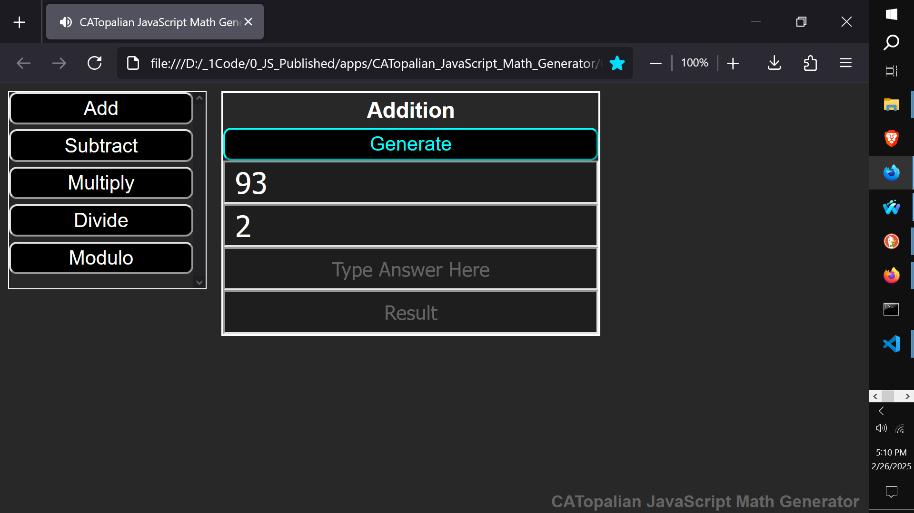
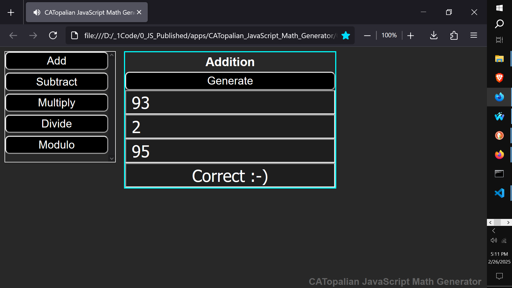
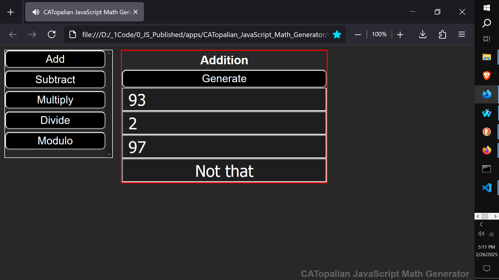
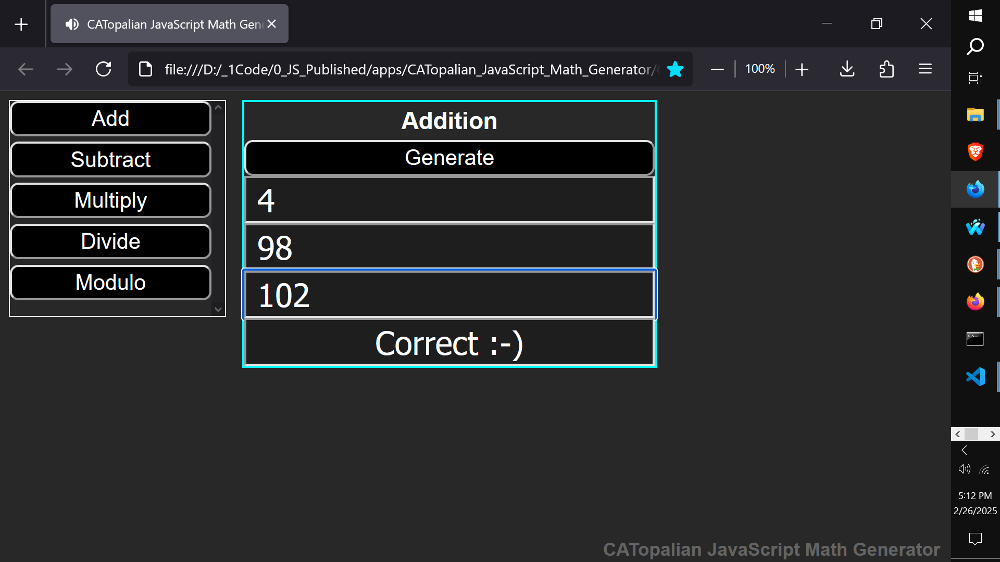
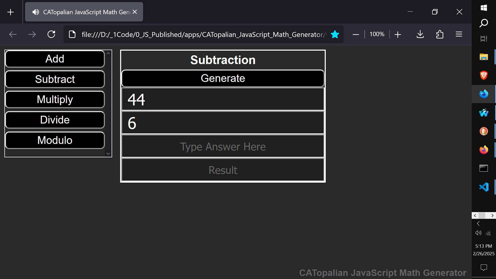
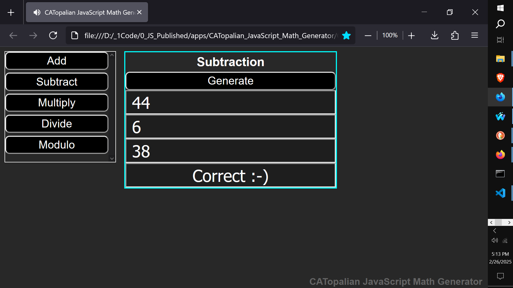
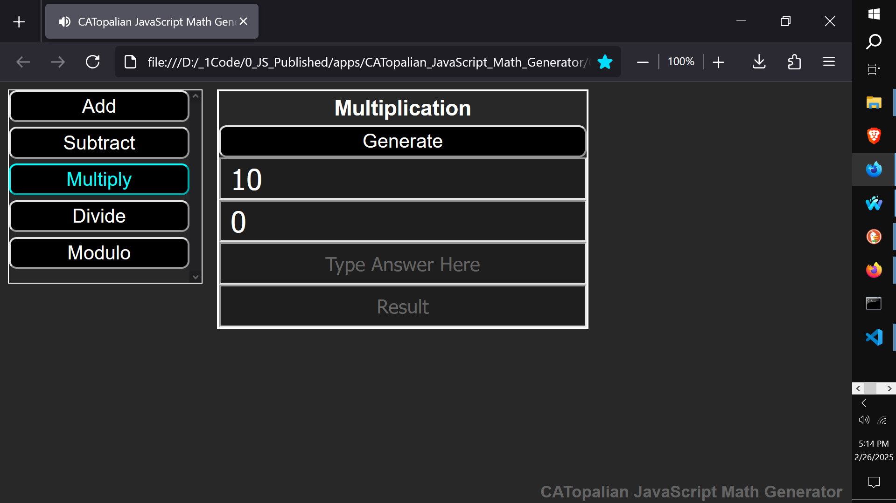
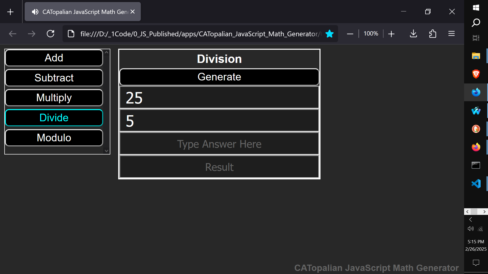
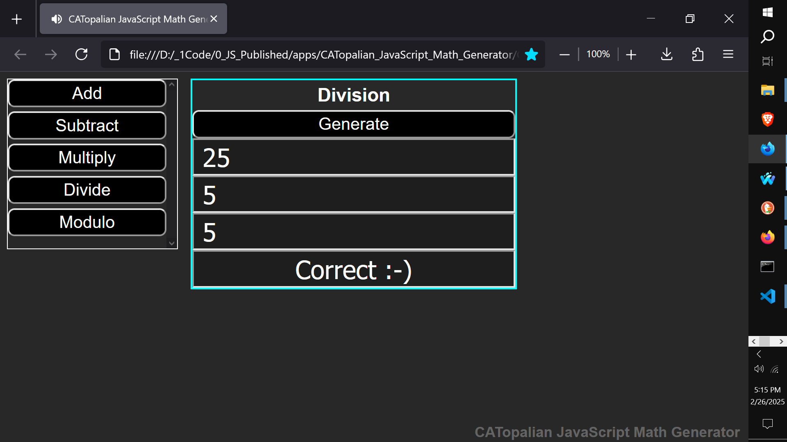
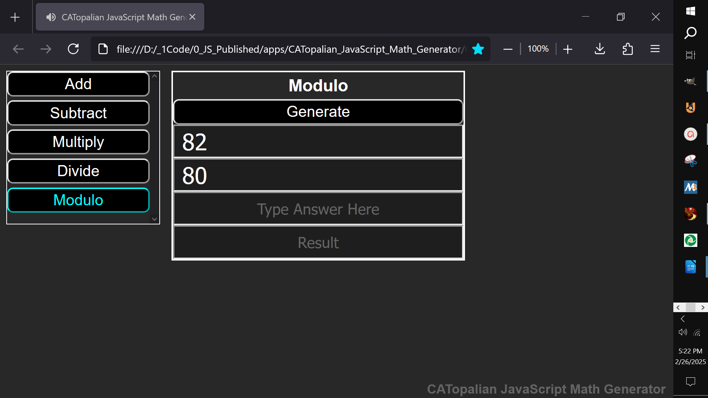

# CATopalian JavaScript Math Generator
A JavaScript application that generates Math Exercises for Addition, Subtraction, Multiplication, Division, and Modulo.

VIDEO: https://www.youtube.com/watch?v=Az30vLbG-Co

https://github.com/ChristopherAndrewTopalian/CATopalian_JavaScript_Math_Generator

