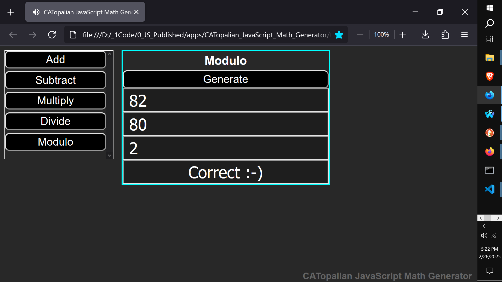

# CATopalian JavaScript Math Generator
A JavaScript application that generates Math Exercises for Addition, Subtraction, Multiplication, Division, and Modulo.

USE APP: https://christopherandrewtopalian.github.io/CATopalian_JavaScript_Math_Generator/CATopalian_JavaScript_Math_Generator.html

VIDEO: https://www.youtube.com/watch?v=Az30vLbG-Co

https://github.com/ChristopherAndrewTopalian/CATopalian_JavaScript_Math_Generator

### How to Download this App
1. **Click** the green **Code Button** on this github page
2. Choose **Download ZIP**
3. **Save** the **Zip File**
4. **Extract All**
5. **Double click** the **HTML file** to start the App

---

Happy Scripting :-)

---

// Dedicated to God the Father  
// All Rights Reserved Christopher Andrew Topalian Copyright 2000-2026  
// https://github.com/ChristopherTopalian  
// https://github.com/ChristopherAndrewTopalian  
// https://sites.google.com/view/CollegeOfScripting

